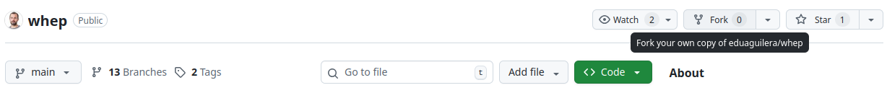
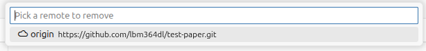
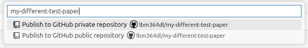

# But you know, papers are collaborative...

## Pfff another coding sermon

Of course we don't live under a rock. I'm writing this because I believe writing science should be an extension of writing programming. All researchers are like programmers, they just don't know it.

How to collaborate? Use git. Just like with any piece of code, I'm also suggesting to store your paper in a GitHub repository and give access to other collaborators.

What's git and GitHub you ask? I devoted the first part of this book to that, but I'm not really satisfied with it and I will rewrite everything at some point.

Here's the thing: you don't need to learn weird git commands and use them in a weird command line if you don't want to. You can do all the basic things directly from Positron.

## Why are you assuming everyone has the ability to code!?

I really believe everyone in the scientific community should learn to code. And I hope _you_ will like this approach and invite your collaborators to do so. _But_, if you're the skeptical reader who will tell me that your collaborators aren't willing to invest time to learn, I give you two options:

- Don't collaborate with them.
- OK, OK, that was harsh. I propose an alternative in the [next chapter](trackdown.qmd).

## How do I upload this thing to my own GitHub?

I will give you two options:

### Fork: copy others' repositories directly from GitHub, start from scratch

If you know you want to start from someone's project but then start adding your own things, you can _fork_ their repository. This will create an exact clone in your own account. 

Once you have that, you can get a local copy the same way we did at the start using the command "New folder from git".

### Push local copy: you already did some work that should be saved

If you followed the previous chapters and created a local folder from the public URL of my repository, you're here. If you played a bit with the paper and added some things that you want to keep, we should just create a new repository in your account which will include all your local content.

1. Your local copy is linking to my own remote repository. Let's remove that. Search the command "Git: Remove Remote" and get rid of my repository.

2. Search the command "Publish to GitHub". You will see some default options, but you can also choose your own name.

3. Done! Check your GitHub account. You should find a new repository with the local content.

## OK but how do I actually use git?

As I said, you can read the boring first part of this book and maybe figure out how to do those things directly from Positron. Or you can search other guides and learn by yourself. You can start from Positron's [Git Version Control guide](https://positron.posit.co/git.html).
