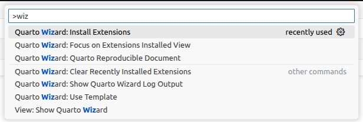

# But how to follow the journal's style?

## The game is afoot

Did you find the example paper familiar? It follows Elsevier style.

How? Time to investigate! Come on, take a look at the subfolder `_extensions/quarto-journals/elsevier`. Why is this working?

- In the file [`_extensions/quarto-journals/elsevier/_extension.yml`](https://github.com/lbm364dl/test-paper/blob/main/_extensions/quarto-journals/elsevier/_extension.yml), a PDF format is specified.
- In the file [`_quarto.yml`](https://github.com/lbm364dl/test-paper/blob/main/_quarto.yml), we choose a format `elsevier-pdf`. The dash separates the custom style name (`elsevier`) and the actual format (`pdf`).
  The custom template name must match the name of the subfolder in `_extensions`.

No, but really, how do we set this custom format? It's the _template partials_. Remember I told you that, before producing a PDF, your Quarto document is converted to LaTeX. Quarto allows you to modify some parts of that LaTeX, without having to provide a fully fledged LaTeX thing, since then it would lose its magic. In this example, you see [`before-body.tex`](https://github.com/lbm364dl/test-paper/blob/main/_extensions/quarto-journals/elsevier/partials/before-body.tex) and [`title.tex`](https://github.com/lbm364dl/test-paper/blob/main/_extensions/quarto-journals/elsevier/partials/title.tex) being used (in the `elsevier/partials` subfolder). These are the parts of our document where we decide to apply some custom behaviour.

Of course you don't need to understand much about this just yet. Before you decide this is too hard for you, check the next section.

## Some people already created custom templates for you

There are a few ready to use templates for some well-known journals. You can find them in [this list](https://quarto.org/docs/extensions/listing-journals.html)... Actually, I'm not sure how that list is maintained. Maybe there are more... You just need to find them. Anyway, how to use these?

There's a [Positron extension](https://positron.posit.co/extensions.html) called [Quarto Wizard](https://quarto.org/docs/blog/posts/2025-10-20-quarto-wizard-1-0-0/). You can read that if you're curious. It's basically there to make it easier to manage [Quarto extensions](https://quarto.org/docs/extensions/). Custom templates for articles are just one kind of Quarto extension, so this might be handy here.

After installing the extension, you can play a bit with the commands. For the one that allows you to install extensions, you might also find it easier to first [search through them here](https://m.canouil.dev/quarto-extensions/). The ones that are custom article templates are most likely under _Formats_. Or the ones that directly appear in the command _Quarto Wizard: Use Template_. Or the ones from the first list I linked... You can find out.

After installing a custom template, also remember to write the correct format name in `_quarto.yml`, e.g., if you instead use `quarto-journals/jasa`, you should write `jasa-pdf` as format.

Just play a bit with the different options. I believe in you.

## There's no template for my journal

Then it's your time to shine... You'll have to create one yourself! OK, maybe you'll struggle a bit, but I'm sure you can do it. And then you can share it and also help others!

I won't go into detail here. You should try to do it by yourself. Things to have in mind:

- Quarto already wrote a nice introduction for [creating custom journal formats](https://quarto.org/docs/journals/formats.html).
- They also provide an [example repository](https://github.com/quarto-journals/article-format-template) which you can start from (also mentioned in the previous link).
- Most journals should provide some LaTeX template on their site. You most likely don't need the whole thing, it's probably a mess. I would just take the most important parts and get something working as fast as possible. Later on you can worry about the details. Or just ignore them. If the output looks like other papers in that journal, you're good to go. You might also ask your favourite AI for help.
- Once it's included in a public repository, you can use it the same way as the others. Just run `quarto use template your-github/your-repo`.

## It's not only papers...

You can also use Quarto to write many other things. Here I focused on papers, but you might also write your PhD thesis! I created myself a [custom template](https://github.com/lbm364dl/quarto-upm-thesis) for [UPM](https://www.upm.es/) thesis.

Take a quick look. You can see that the project type in `_quarto.yml` is `book`. I don't really know what important differences this has compared to `manuscript`. It's probably almost the same, but this makes it easier to write each chapter or section in a separate Quarto file, to keep everything more organized. I myself took inspiration from [this template](https://github.com/nmfs-opensci/quarto-thesis). 

Again, you can take these as a starting point and build your own template. Please share it if you do!
