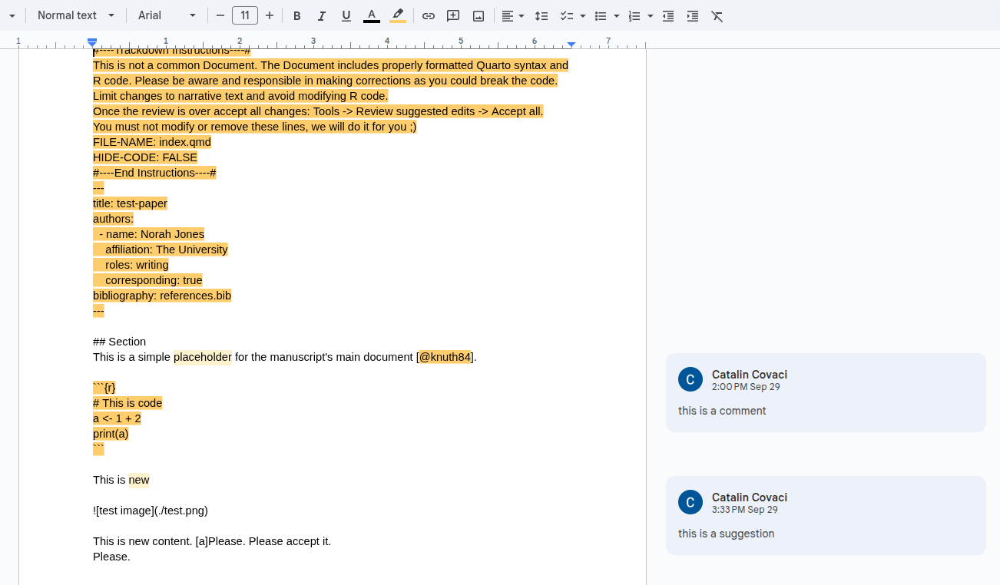

# But there's this collaborator who can't code...

Yes, you're right... That's most likely going to happen!

What if we create a version of the paper in a _parallel universe_ where your collaborator won't have any excuses?

## Just send them a Google Docs link

OK, at least _you_ are the programmer and by now you know how to use Quarto and git. _You_ will also be responsible for having the paper up to date in the GitHub repository. 

But your collaborators don't need to know about that.

The workflow would look like this:

1. You write something. You put that in Google Docs. You send it to collaborators for feedback.
2. They add suggestions and comments. You accept them.
3. You take all those changes back to the Quarto and git version.
4. You write more things. Repeat.

## How to sync the Google Docs file? Manually?? You kidding??? {#sync}

_No, no, no, no, no_.

We use [trackdown](https://claudiozandonella.github.io/trackdown/). This is an R package that will let us easily sync the Quarto and git version with a Google Docs one. The package currently seems unmaintained, but it does its job, so we're going to use it anyway.

The previous steps, now including trackdown, would look like this:

1. You write something blah blah blah. You use `trackdown::upload_file("path/to/file.qmd")` (if first time upload) or `trackdown::update_file("path/to/file.qmd")` (if Google Docs file already existed). You ask for feedback.
2. You're done with feedback.
3. You get everything back with `trackdown::download_file("path/to/file.qmd")`.
4. Repeat.

Actually, there's absolutely no need for you to stop writing until the collaborators are done with their feedback. You should be using git, remember? If you always commit your changes, you have nothing to fear. Even if you screw up, you can undo.

Yes, your local universe and the Google Docs universe might have diverged and you might have to reconcile them, but deal with it. Solving conflicts is the daily life of the programmer. We'll get back to this in [the last section](#workflow).

## The fortunately onetime but hilariously long instructions to configure trackdown

If you tried the above trackdown commands, you might have failed miserably. We still need to configure trackdown to be able to access your Google account and do some things on your behalf. 

If you don't trust what this thing might do, I think the best option isn't quitting this guide and going back to Microsoft Word, but rather creating a new Google account only for this, so you don't compromise anything else. You decide.

Alright, once you have your desired Google account, get ready for the ~~depressing~~ fun instructions. Please, bear with me, you'll only have to do this once:

1. Open [your Google Cloud Platform project](https://console.cloud.google.com/), signed in with your Google account. You might be asked to add another authentication step to your account. Just do that and then keep going.
2. Open [this link](https://console.cloud.google.com/auth/overview/create) to create an _app_ (whatever that means). Fill things:
    - App Information:
        - App name: whatever, e.g., Trackdown
        - User support email: your own email
    - Audience: external
    - Contact Information: your own email
    - Finish: agree
    - Finally, create
3. Open [this link](https://console.cloud.google.com/auth/audience) to add yourself as test user (whatever that means).
    - In _Test users_, click _Add users_
    - Add your own email
    - Click _Save_ (twice if necessary)
4. Open [this link](https://console.cloud.google.com/apis/library/drive.googleapis.com) and click _Enable_ to allow programmatic access to Google Drive.
5. Open [this link](https://console.cloud.google.com/apis/library/docs.googleapis.com) and click _Enable_ to allow programmatic access to Google Docs.
6. Open [this link](https://console.cloud.google.com/auth/clients/create) to create an OAuth client ID (whatever that means). Fill things:
    - Application type: Desktop app
    - Name: whatever, e.g. Trackdown
    - Click create
    - Click  _Download JSON_. The name of the downloaded file should be something like `client_secret_some_long_code.apps.googleusercontent.com.json`.
7. Actually use these credentials:
    - Put that JSON file in the main folder of the project (the same folder where the `README.md` file is).
    - Rename it as `trackdown_access.json`. The `.json` is the extension, and you might not need to write it if you use e.g. Windows file explorer. If something goes wrong, make sure you didn't name it `trackdown_access.json.json` by mistake.
8. Restart your R session. Your credentials are read automatically from `.Rprofile` every time you open an R session here. If you already had an open session while setting the credentials file, it won't be read until you restart the session.
9. Actually use trackdown! Check the [previous section](#sync) for the important functions. When using trackdown update/download functions, the first time you will be asked to grant access in your browser. **Toggle the _allow read/write access_ button before continuing**. Otherwise it won't work.

## I'm not really sure how to integrate both places... {#workflow}

Right, I gave you the tools but maybe the process is still a bit confusing. 

I tried to design a workflow myself. I hope it makes things clearer. You'll need to know how to work with branches in git. Again, you can read about that in my boring guide or use something else, like [the Positron/VS Code guide](https://positron.posit.co/git.html#working-with-branches).

1. The `main` branch must contain the most up to date reviewed version of the paper.
2. The `sync-google-doc` branch will be up to date with the Google Docs version of your paper.
3. When a certain review stage finishes, you download the content into `sync-google-doc` with trackdown and create a Pull Request from `sync-google-doc` to `main`.
4. You will see a preview of the PDF result in the Pull Request after a while.
5. If you're satisfied with the result, you merge into `main`.
6. If you want to add new content yourself directly in the repository, you create your own branch. When you're done, you merge to `main`. If you're that lazy and you're the only one actively using the repository, you can even push to main directly, but I highly recommend using other branches for better organization.
7. If there are local changes not in the Google doc, you do `git pull origin main` from the `sync-google-doc` branch to update it (or command _Git: Pull from..._ in Positron). You then update the Google doc using trackdown. **Please have a clean Google doc state before (no pending comments/suggestions), otherwise you may lose changes when overwriting.**
8. Ask for a new review. Go back to step 3.

## My collaborator doesn't understand this weird Google Docs file

It is what it is...

The main idea behind this is that they mostly want to review plain text. If you try using trackdown, you will see that it shows raw Markdown in the file, no images, no plots, no formatting...

You should also send them a PDF of that paper version so they can see everything neatly rendered in case they want to provide extra feedback not directly related to text. But they won't be able to modify that directly. We assume they only want to suggest text changes themselves. For the rest, they either learn how to use the repository or you yourself should do those changes.

Also, just remind them not to change orange text. You don't want them to break your code, don't you? It already says that at the start, but yeah, people don't read those things...
